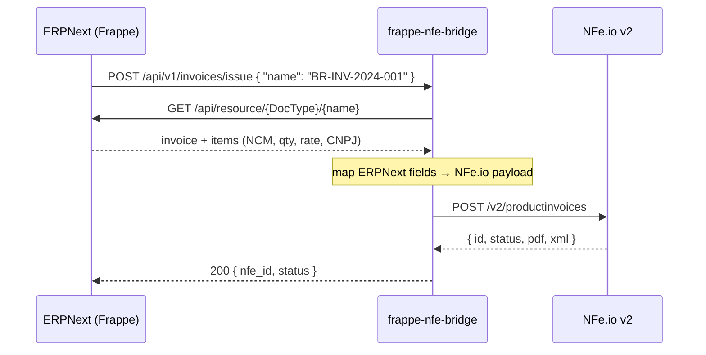

# frappe-nfe-bridge

A small Go service that issues Brazilian electronic invoices (NF-e) from ERPNext.

When an invoice is submitted in ERPNext, the service receives a webhook, reads the
document back from the Frappe REST API, maps it to the [NFe.io](https://nfe.io) v2
payload format, and requests issuance. It exists because ERPNext has no native
NF-e support, and the mapping between an ERPNext DocType and the fiscal fields a
Brazilian invoice requires (NCM, CFOP, CNPJ) is specific enough to deserve its own
service rather than a pile of server scripts.

## How it works



The webhook carries only the document ID. The service fetches the full document
itself instead of trusting the webhook body, so a partial or stale payload can't
produce a wrong invoice.

## Architecture

The project follows a layered structure with dependency inversion at each boundary —
every layer depends on an interface, and `cmd/main.go` is the only place that knows
which concrete implementation is wired in.

```
cmd/main.go                     config loading, DI, routes, server startup
internal/
  handler/invoice_hdl.go        HTTP concerns: parse body, map errors to status codes
  service/issuer.go             orchestration + the ERPNext → NFe.io mapper (pure logic)
  repository/frappe.go          ERPNext REST client (token auth)
  repository/nfeio.go           NFe.io REST client
  models/                       DTOs for both sides of the mapping
  middleware/auth.go            HMAC-SHA256 webhook signature verification
```

The practical payoff is that the mapper — the part with actual business rules — is a
pure function over structs, with no HTTP or framework types in its signature, so it
can be tested without standing up a server or mocking a transport.

**Stack:** Go 1.23 · [Fiber v2](https://gofiber.io) · [godotenv](https://github.com/joho/godotenv) · no database (the service is stateless)

## API

| Method | Path                     | Description                                    |
| ------ | ------------------------ | ---------------------------------------------- |
| `POST` | `/api/v1/invoices/issue` | Webhook target. Body: `{ "name": "<doc-id>" }` |
| `GET`  | `/health`                | Liveness check                                 |

Success returns `200` with `{ "message", "nfe_id", "status" }`. A malformed body
returns `400`; a failure against ERPNext or NFe.io returns `500`.

## Configuration

All configuration comes from the environment (a local `.env` is loaded if present).
The service exits at startup if `FRAPPE_URL` or `NFE_API_KEY` is missing.

| Variable            | Required | Default | Description                                     |
| ------------------- | -------- | ------- | ----------------------------------------------- |
| `PORT`              | no       | `3000`  | HTTP listen port                                |
| `FRAPPE_URL`        | **yes**  | —       | Base URL of the ERPNext instance                |
| `FRAPPE_API_KEY`    | yes      | —       | Frappe API key                                  |
| `FRAPPE_API_SECRET` | yes      | —       | Frappe API secret                               |
| `NFE_API_KEY`       | **yes**  | —       | NFe.io API key                                  |
| `NFE_COMPANY_ID`    | yes      | —       | Issuing company ID in NFe.io                    |
| `CUSTOM_DOCTYPE`    | yes      | —       | Name of the invoice DocType (spaces are fine)   |
| `WEBHOOK_SECRET`    | no       | —       | HMAC secret — see *Known limitations*           |
| `WEBHOOK_SIGNATURE` | no       | —       | Header carrying the signature                   |

## Running locally

```bash
git clone https://github.com/luigiazoreng/nfe-go.git
cd nfe-go
cp .env.example .env   # then fill in the values above
go mod download
go run ./cmd
```

```bash
curl -X POST http://localhost:3000/api/v1/invoices/issue \
  -H 'Content-Type: application/json' \
  -d '{"name":"BR-INV-2024-001"}'
```

## Known limitations

This is an early cut, and a few things are deliberately called out rather than
papered over:

- **The signature middleware is not wired up.** `middleware.WebhookAuth` implements
  HMAC-SHA256 verification, but no route currently uses it — the issue endpoint is
  unauthenticated. Do not expose this publicly as-is.
- **CFOP is hardcoded to `5102`** in the mapper. Real deployments need it derived from
  the operation type and the buyer's state.
- **Buyer address is not mapped.** `models.Address` is defined but left empty, which
  NFe.io will reject for most operations.
- **The PDF/XML URLs are not written back to ERPNext.** `IssueNoteForFrappeInvoice`
  has the call sketched out but commented.
- **No retry or idempotency.** A duplicate webhook will attempt a second issuance.
- **No test suite yet** — the mapper is the natural place to start.
- `internal/router/nfeio.go` is an unused stub left over from an earlier layout.

## Roadmap

- [ ] Wire `WebhookAuth` into the `/api/v1` group
- [ ] Table-driven tests for the ERPNext → NFe.io mapper
- [ ] Derive CFOP from operation type and destination state
- [ ] Map the buyer address block
- [ ] Persist `nfe_id` / PDF / XML back to the ERPNext document
- [ ] Idempotency key per invoice reference
- [ ] Dockerfile and CI
